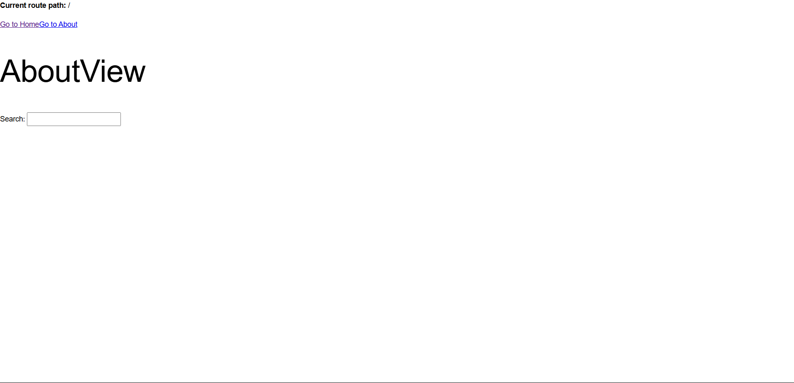
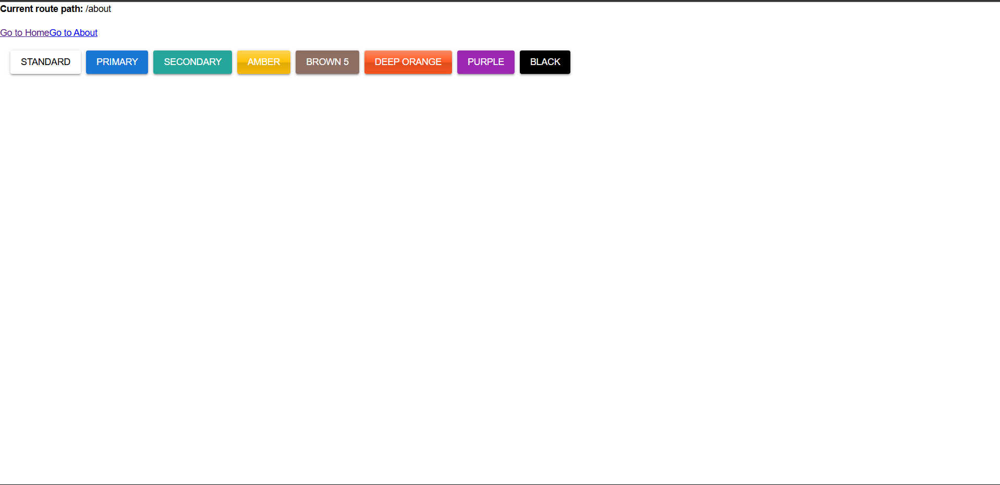

### Materi Pertemuan 5 PBK 

Menerapkan Materi framework Quasar & Vue Router 

### 1. Masuk ke folder project
materi-pertemuan5pbk

### 2. Install dependencies
npm install

### 3. Jalankan server pengembangan
npm run dev

### Akses aplikasi di browser
buka di browser port http://localhost:5173

### Hasil 

